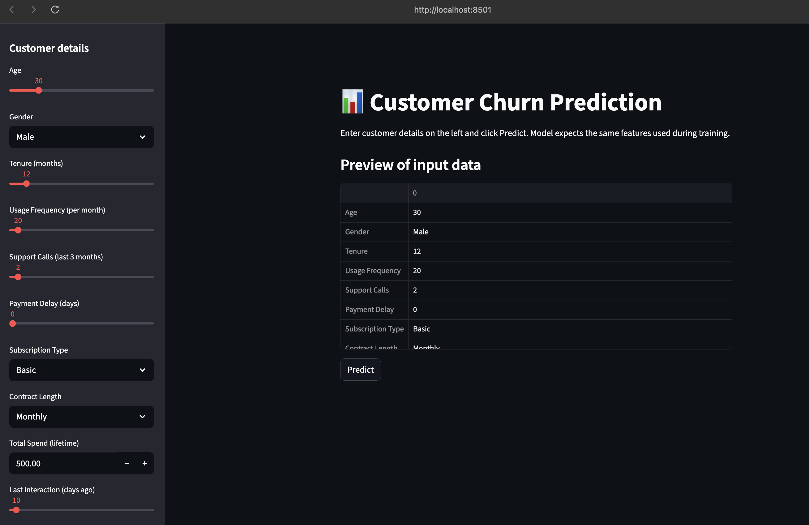
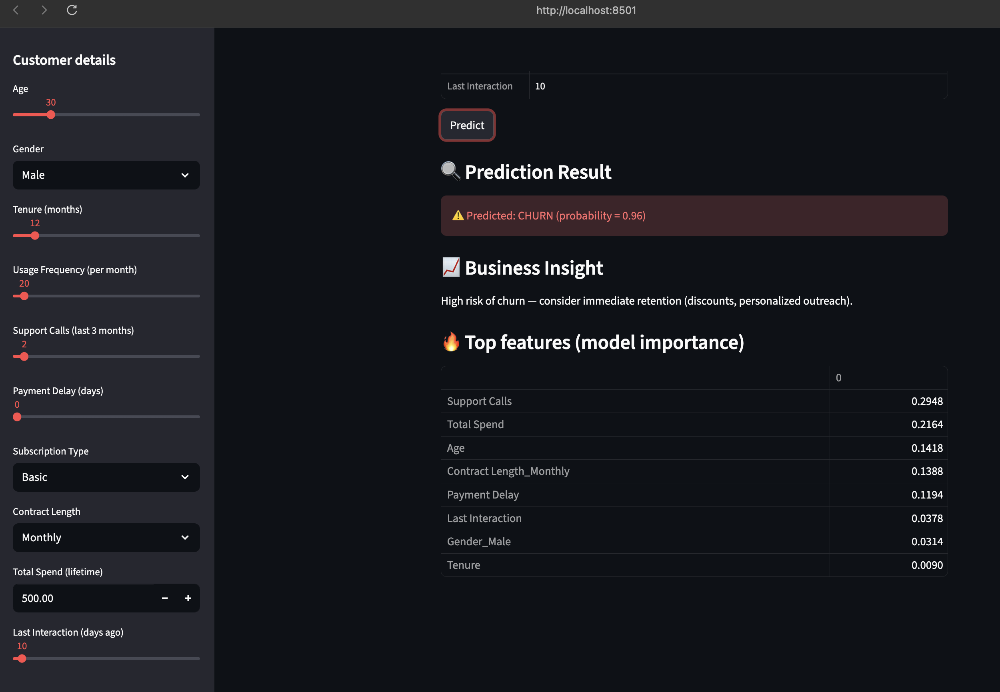
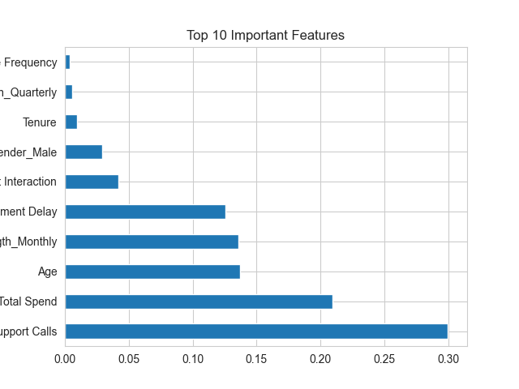

# 📊 Customer Churn Prediction System

## 🚀 Problem Statement
Customer churn is a major problem for subscription-based businesses. Losing customers directly impacts revenue.  
This project aims to predict whether a customer will churn based on their behavior and usage patterns.

---

## 📁 Dataset
The dataset contains customer information such as:

- Age  
- Gender  
- Tenure  
- Usage Frequency  
- Support Calls  
- Payment Delay  
- Subscription Type  
- Contract Length  
- Total Spend  
- Last Interaction  
- Churn (Target Variable)

---

## 🔍 Exploratory Data Analysis (EDA)

Performed detailed analysis to understand customer behavior:

- Churn distribution analysis  
- Feature relationships with churn  
- Correlation heatmap  
- Feature importance analysis  

### 📊 Key Insights:

- Customers with **low tenure** are more likely to churn  
- High number of **support calls** indicates dissatisfaction  
- **Subscription type** significantly affects churn  
- Customers with higher **total spend** are more loyal  

---

## 🤖 Machine Learning Models Used

- Logistic Regression  
- Random Forest (Best Model)  
- XGBoost  

---

## 📈 Model Evaluation

Evaluated using:

- Accuracy  
- Precision  
- Recall  
- F1 Score  

👉 Random Forest performed best with balanced performance.

---

## 💻 Web App (Streamlit)

Built an interactive web app where users can:

- Enter customer details  
- Predict churn probability  
- Get business insights  

---

## 📸 Screenshots

### 🔹 App Interface


### 🔹 Prediction Result


### 🔹 EDA Visualization


---

## ⚙️ Tech Stack

- Python  
- Pandas, NumPy  
- Scikit-learn  
- XGBoost  
- Matplotlib, Seaborn  
- Streamlit  

---

## ▶️ How to Run Locally

```bash
# Clone repository
git clone <your-repo-link>

# Go to project folder
cd customer-churn-ml

# Create virtual environment
python -m venv venv
source venv/bin/activate  # Mac/Linux

# Install dependencies
pip install -r requirements.txt

# Run app
streamlit run app.py